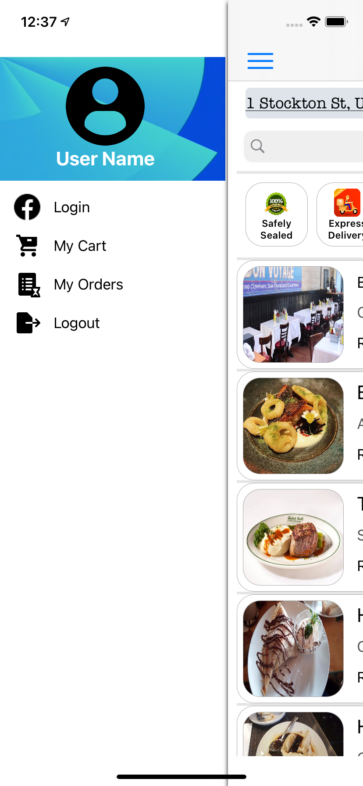

# About
This is a Restaurant Aggregator and Food Ordering native iOS application that replicates Zomato application and built for learning purpose only. 
 Following are the key features of the app-  
1. User can sign in using Facebook account.
2. It provides user with a seamless experience of searching restaurants, cuisines and dishes.
3. Search results are based on user's geographic proximity to the restaurants.
4. Rating and pictures of searched restaurants are displayed.
5. All past orders and details are stored locally that are available even when offline.

<h3>Note: MVC architecture has been followed.</h3>

# Screenshots

  
  
  
  
  

 

  
  
  
  
  
  

